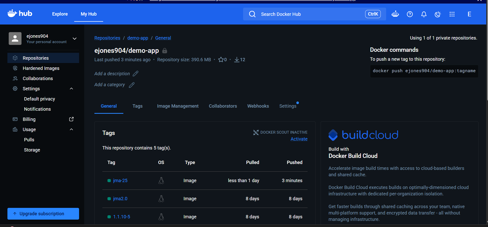

# Jenkins Shared Library CI/CD Pipeline

## Project Overview

This project started as an exercise in creating a Jenkins Shared Library.

It turned into a much deeper lesson in how CI/CD systems actually work.

The goal was to take pipeline functionality that would normally live directly inside a Jenkinsfile and move it into reusable Groovy functions that Jenkins pipelines can call when needed.

The final solution integrates GitHub, Jenkins, Jenkins Shared Libraries, Groovy, Maven, Java/Spring Boot, Docker, Docker Hub, Jenkins Credentials, and Linux permissions into a working CI/CD workflow.

After a lot of troubleshooting — and 25 Jenkins builds — the pipeline successfully:

- Retrieves the project from GitHub
- Loads a Jenkins Shared Library
- Executes reusable Groovy pipeline functions
- Builds and packages a Java application with Maven
- Creates a JAR artifact
- Builds a Docker image
- Generates a Docker image tag using the Jenkins build number
- Authenticates to Docker Hub using Jenkins-managed credentials
- Pushes the versioned image to Docker Hub

The final successful execution was:

```text
Build #25 — SUCCESS
```

This project reinforced something important for me: getting a pipeline to work is only part of CI/CD engineering. Understanding why it fails, isolating each layer, and following the error messages until the actual root cause is found is just as important.

---

# Business / Engineering Problem

CI/CD pipelines often repeat the same logic across multiple applications.

For example:

```text
Build application
Build container image
Authenticate to registry
Push container image
```

Copying this logic into every Jenkinsfile creates duplication and makes pipelines harder to maintain.

Jenkins Shared Libraries provide a way to centralize reusable CI/CD functionality.

Instead of putting all implementation logic directly into a Jenkinsfile, pipelines can call reusable functions such as:

```groovy
buildJar()
buildImage()
dockerLogin()
dockerPush()
```

The implementation behind those functions can then be maintained centrally.

This creates a foundation for more standardized and reusable CI/CD automation.

---

# Architecture

```text
┌──────────────────────┐
│      Developer       │
└──────────┬───────────┘
           │
           │ git push
           ▼
┌──────────────────────┐
│        GitHub        │
│ Jenkins Shared       │
│ Library Repository   │
└──────────┬───────────┘
           │
           │ SCM Checkout
           ▼
┌──────────────────────┐
│       Jenkins        │
│       Pipeline       │
└──────────┬───────────┘
           │
           ├──────────────► Jenkins Shared Library
           │                  │
           │                  ├── buildJar()
           │                  ├── buildImage()
           │                  ├── dockerLogin()
           │                  └── dockerPush()
           │
           ▼
┌──────────────────────┐
│      Maven 3.9       │
│     mvn package      │
└──────────┬───────────┘
           │
           ▼
┌──────────────────────┐
│       Java JAR       │
│       target/        │
└──────────┬───────────┘
           │
           ▼
┌──────────────────────┐
│        Docker        │
│     Build Image      │
└──────────┬───────────┘
           │
           │ Jenkins Credentials
           ▼
┌──────────────────────┐
│      Docker Hub      │
│   ejones904/demo-app │
│       jma-N          │
└──────────────────────┘
```

---

# CI/CD Workflow

The final working pipeline follows this sequence:

```text
Developer Changes
       ↓
Git Commit
       ↓
Push to GitHub
       ↓
Jenkins SCM Checkout
       ↓
Load Jenkins Shared Library
       ↓
Initialize Pipeline
       ↓
Maven Package
       ↓
Generate Java JAR
       ↓
Docker Build
       ↓
Generate Build-Specific Image Tag
       ↓
Jenkins Credentials Injection
       ↓
Docker Hub Authentication
       ↓
Docker Push
       ↓
Versioned Image Published
       ↓
SUCCESS
```

---

# Technology Stack

## CI/CD

- Jenkins
- Jenkins Declarative Pipeline
- Jenkins Shared Libraries
- Jenkins SCM Integration
- Jenkins Credentials

## Development & Build

- Groovy
- Java 17
- Spring Boot
- Maven 3.9

## Containers

- Docker
- Dockerfile
- Docker Hub
- Docker Registry Authentication
- Docker Socket Integration

## Source Control

- Git
- GitHub
- SSH Authentication

## Infrastructure / Environment

- Linux
- Docker
- WSL
- IntelliJ IDEA

---

# Repository Structure

The project combines application source code with Jenkins Shared Library components.

```text
jenkins-shared-library/
│
├── Dockerfile
├── pom.xml
├── script.groovy
│
├── src/
│   ├── Jenkinsfile
│   │
│   ├── com/
│   │   └── example/
│   │       └── Docker.groovy
│   │
│   └── main/
│       └── java/
│           └── com/
│               └── example/
│                   └── Application.java
│
└── vars/
    ├── buildImage.groovy
    ├── buildJar.groovy
    ├── dockerLogin.groovy
    └── dockerPush.groovy
```

Generated Maven artifacts are created under:

```text
target/
```

including:

```text
java-maven-app-1.1.0-SNAPSHOT.jar
```

---

# Jenkins Shared Library Design

The Shared Library separates easy-to-call pipeline functions from their reusable implementation logic.

## `vars/`

The `vars/` directory exposes global Jenkins pipeline steps.

```text
vars/
├── buildImage.groovy
├── buildJar.groovy
├── dockerLogin.groovy
└── dockerPush.groovy
```

These allow the Jenkinsfile to use simple calls such as:

```groovy
buildJar()
buildImage "ejones904/demo-app:${imageTag}"
dockerLogin()
dockerPush "ejones904/demo-app:${imageTag}"
```

This keeps the Jenkinsfile easier to read and reduces duplicated pipeline logic.

---

# Shared Library Classes

Reusable implementation classes are stored under:

```text
src/com/example/
```

For example:

```text
src/com/example/Docker.groovy
```

This class contains reusable Docker-related implementation logic.

One of the important lessons from this project was understanding that Jenkins Shared Library classes and Maven application classes use different directory conventions.

Jenkins Shared Library class:

```text
src/com/example/Docker.groovy
```

Maven Java application class:

```text
src/main/java/com/example/Application.java
```

Understanding which tool owns which source structure became critical to getting the pipeline working correctly.

---

# Maven Build Process

The Java application is packaged through Maven.

The Shared Library exposes the build functionality through:

```groovy
buildJar()
```

which ultimately executes:

```bash
mvn package
```

The Maven project uses:

```text
groupId:    com.example
artifactId: java-maven-app
version:    1.1.0-SNAPSHOT
```

and Java 17.

A successful Maven build generates:

```text
target/java-maven-app-1.1.0-SNAPSHOT.jar
```

The resulting JAR becomes the application artifact used during the Docker image build.

---

# Docker Build Automation

Docker functionality was separated into reusable operations:

```text
Build Image
    ↓
Docker Login
    ↓
Push Image
```

The Shared Library exposes these through:

```groovy
buildImage()
dockerLogin()
dockerPush()
```

This separation made the Docker lifecycle easier to understand, reuse, and troubleshoot.

---

# Dynamic Docker Image Versioning

Rather than continuously publishing the same static image tag, the pipeline uses the Jenkins build number to generate a unique image tag.

```groovy
def imageTag = "jma-${env.BUILD_NUMBER}"
```

The resulting image reference becomes:

```text
ejones904/demo-app:jma-<BUILD_NUMBER>
```

For example:

```text
ejones904/demo-app:jma-25
```

The same image reference is passed through both the Docker build and Docker push operations.

This provides simple traceability between:

```text
Jenkins Build #25
        ↓
Docker Image jma-25
```

---

# Docker Hub Integration

The final container image is published to:

```text
docker.io/ejones904/demo-app
```

The project originally referenced a training/demo Docker Hub repository that was not owned by my account.

The pipeline was updated to use my own repository:

```text
ejones904/demo-app
```

This allowed the pipeline to authenticate and publish the generated images to the correct registry repository.

---

# Credential Management

Credentials are managed through Jenkins rather than stored directly in source control.

## Docker Hub

The Jenkins credential ID used for Docker Hub is:

```text
docker-hub-repo
```

The pipeline injects the username and password only when required.

Conceptually:

```groovy
withCredentials([
    usernamePassword(
        credentialsId: 'docker-hub-repo',
        passwordVariable: 'PASS',
        usernameVariable: 'USER'
    )
]) {
    sh "echo '${PASS}' | docker login -u '${USER}' --password-stdin"
}
```

This prevents Docker Hub credentials from being hard-coded into the repository.

## GitHub

Jenkins accesses the GitHub repository using the Jenkins credential:

```text
Jenkins-Github
```

This allows Jenkins to authenticate to GitHub and retrieve the pipeline and Shared Library source.

---

# Jenkins and Docker Integration

Jenkins runs inside a Docker container using:

```text
jenkins/jenkins:lts
```

The host Docker socket is mounted into the Jenkins container:

```text
/var/run/docker.sock:/var/run/docker.sock
```

This allows Jenkins running inside the container to communicate with the Docker daemon on the host and execute commands such as:

```bash
docker build
docker login
docker push
```

Correct Linux group permissions are required for the Jenkins user to access the Docker socket.

---

# Pipeline as Code

The Jenkins Pipeline definition is stored at:

```text
src/Jenkinsfile
```

Jenkins SCM configuration points to this path when retrieving the Pipeline from GitHub.

The Shared Library is loaded using:

```groovy
@Library('jenkins-shared-library') _
```

This allows the Jenkinsfile to call the reusable functionality exposed by the Shared Library.

---

# Successful Pipeline Execution

After iterative development and troubleshooting across Jenkins, GitHub, Maven, Groovy, Linux, and Docker, the complete workflow successfully executed.

```text
Build #25
```

completed successfully.


The successful build confirmed that Jenkins could:

```text
Checkout Source
      ↓
Load Shared Library
      ↓
Build Java Application
      ↓
Package JAR
      ↓
Build Docker Image
      ↓
Authenticate to Docker Hub
      ↓
Push Versioned Image
      ↓
SUCCESS
```

---

# Docker Hub Validation

The result was also validated outside Jenkins.

Docker Hub confirmed that the versioned image produced by the pipeline was successfully published to:

```text
ejones904/demo-app
```



This provided external validation that the CI/CD workflow completed successfully rather than relying only on the Jenkins build status.

---

# Selected Troubleshooting

This project required troubleshooting across nearly every layer of the CI/CD workflow.

Rather than treating each error independently, I learned to use each failure to identify which part of the pipeline had successfully completed and which layer needed investigation next.

Some of the most important issues included:

## Jenkins → Docker Permissions

Jenkins initially received:

```text
permission denied while trying to connect to the docker API
```

Docker itself was verified as healthy using:

```bash
systemctl status docker
```

The problem was isolated to Jenkins access to:

```text
/var/run/docker.sock
```

The Jenkins user's group access was corrected without rebuilding the existing Jenkins environment.

## Jenkins Shared Library Structure

A reusable `Docker.groovy` class was initially placed within Maven's source structure.

The correct Shared Library location was:

```text
src/com/example/Docker.groovy
```

while the Java application belonged under:

```text
src/main/java/com/example/Application.java
```

This clarified the difference between Jenkins Shared Library classpaths and Maven source conventions.

## Maven Source Discovery

Maven reported:

```text
No sources to compile
```

Investigation revealed the Java source was located under:

```text
src/src/main/java/
```

instead of:

```text
src/main/java/
```

After correcting the source path, Maven successfully generated:

```text
target/classes/com/example/Application.class
```

## Docker Build / Push Logic

The Shared Library originally mixed Docker build, login, and push responsibilities.

These were separated into:

```text
buildDockerImage()
dockerLogin()
dockerPush()
```

This made the workflow easier to debug and reuse.

## Docker Image Tagging

An image was once pushed using a tag that had never actually been built, producing:

```text
tag does not exist
```

The final pipeline generates one image tag:

```groovy
def imageTag = "jma-${env.BUILD_NUMBER}"
```

and passes that exact value to both the build and push operations.

## Missing Dockerfile

Once Jenkins successfully reached the Docker build operation, Docker reported:

```text
Dockerfile: no such file or directory
```

A Dockerfile was added at the repository root, matching the build context used by:

```bash
docker build -t <image> .
```

The progression of errors helped show that Jenkins was reaching farther into the pipeline as each underlying problem was resolved.

A more detailed troubleshooting history is available in:

```text
TROUBLESHOOTING-AND-LESSONS-LEARNED.md
```

---

# Security Considerations

Security practices demonstrated in this project include:

- Jenkins-managed credentials
- No Docker Hub passwords stored in source control
- No GitHub credentials stored directly in pipeline code
- Docker authentication using `--password-stdin`
- Credential IDs referenced instead of secret values
- Docker socket access controlled through Linux permissions
- GitHub authentication managed through Jenkins
- Separation of credentials from reusable Shared Library code

Production improvements could include:

- Scoped registry access tokens
- Credential rotation
- Dedicated Jenkins agents
- More restrictive Docker daemon access
- Containerized or ephemeral build agents
- TLS
- Centralized secrets management
- Image vulnerability scanning
- Least-privilege service accounts

---

# Key Achievements

- Built a reusable Jenkins Shared Library using Groovy
- Exposed reusable Jenkins pipeline steps through `vars/`
- Created reusable implementation logic under the Shared Library `src/` classpath
- Integrated Jenkins with GitHub SCM
- Configured Jenkins Pipeline as Code
- Built and packaged a Java/Spring Boot application using Maven
- Generated a deployable JAR artifact
- Integrated Docker builds into a containerized Jenkins environment
- Configured Jenkins access to the host Docker daemon
- Managed Docker Hub authentication through Jenkins Credentials
- Automated Docker image publishing
- Implemented Jenkins build-number-based Docker image versioning
- Created traceability between Jenkins builds and Docker images
- Diagnosed Linux/Docker socket permissions
- Diagnosed Maven and Java source-path issues
- Diagnosed Jenkins Shared Library classpath issues
- Debugged Groovy syntax, method, variable-scope, and interpolation issues
- Resolved GitHub/SSH and local WSL repository issues
- Successfully completed the full pipeline with Build #25

---

# What I Learned

The biggest lesson from this project was not one specific Jenkins command.

It was learning how to troubleshoot a CI/CD pipeline as a connected system.

A Jenkins failure can originate from:

```text
Git
Groovy
Jenkins configuration
Shared Library structure
Maven
Java
Linux permissions
Docker
Credentials
Registry permissions
Filesystem paths
```

The error displayed in Jenkins is often only the symptom of whichever layer the pipeline has reached.

Instead of repeatedly changing configuration, I learned to verify each layer independently and use the latest error to narrow the search.

The progression looked something like:

```text
Docker permission denied
        ↓
Fix Jenkins Docker access
        ↓
Docker tag does not exist
        ↓
Fix Shared Library build/push logic
        ↓
Dockerfile not found
        ↓
Add correct Docker build definition
        ↓
Pipeline continues farther
        ↓
SUCCESS
```

Sometimes a new error is actually progress.

It means the previous problem is no longer stopping the pipeline.

---

# Skills Demonstrated

## Jenkins / CI/CD

- Jenkins
- Jenkins Declarative Pipelines
- Jenkins Shared Libraries
- Pipeline as Code
- Reusable pipeline functions
- Jenkins SCM integration
- Jenkins build variables
- Jenkins Credentials

## Development / Automation

- Groovy
- Java
- Spring Boot
- Maven 3.9
- Maven project structure
- JAR packaging

## Containers

- Docker
- Dockerfiles
- Docker image builds
- Docker image tagging
- Docker Hub
- Container registry authentication
- Docker socket integration

## Linux

- Linux permissions
- Users and groups
- Unix sockets
- Docker daemon troubleshooting
- systemd
- Filesystem troubleshooting
- WSL

## Source Control

- Git
- GitHub
- SSH authentication
- Branch configuration
- Repository troubleshooting
- Iterative commits and pushes

## Troubleshooting

- CI/CD log analysis
- Root-cause isolation
- Jenkins execution context
- Groovy debugging
- Maven source discovery
- Java package structure
- Docker permissions
- Docker build context
- Registry authentication

---

# Screenshots

Only the most meaningful evidence from the completed project is included.

## Jenkins Build #25 — Success


Shows the successful end-to-end Jenkins Shared Library pipeline execution.

## Docker Hub Confirmation


Confirms that the Jenkins-generated Docker image was successfully published to Docker Hub.

---

# Future Improvements

Potential next steps include:

- Separate the Shared Library from the sample application repository
- Consume the Shared Library from multiple independent Jenkins pipelines
- Add automated unit-test reporting
- Add Docker image vulnerability scanning
- Add SonarQube or other static analysis
- Add deployment stages
- Deploy the image to Kubernetes
- Add environment-specific deployment logic
- Add approval gates
- Add automated rollback logic
- Use dedicated Jenkins agents
- Use ephemeral container-based build agents
- Add webhook-triggered builds
- Add centralized secrets management

The most important next architectural improvement would be demonstrating the same Shared Library functions being consumed by multiple independent pipelines, showing how centralized CI/CD logic can be reused across applications.

---

# Final Result

After 25 builds, multiple layers of troubleshooting, and several architecture corrections:

```text
GitHub
   ↓
Jenkins
   ↓
Jenkins Shared Library
   ↓
Maven 3.9
   ↓
Java JAR
   ↓
Docker Build
   ↓
Versioned Image
   ↓
Jenkins Credentials
   ↓
Docker Hub
   ↓
SUCCESS
```

The pipeline worked end-to-end.

More importantly, I came away with a much better understanding of what is actually happening between each of those arrows.

---

## Author

**Ethan Jones**

Cloud & DevOps Portfolio
