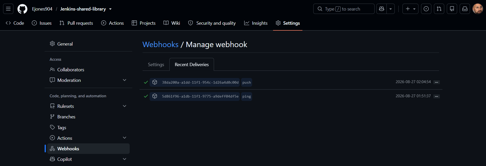
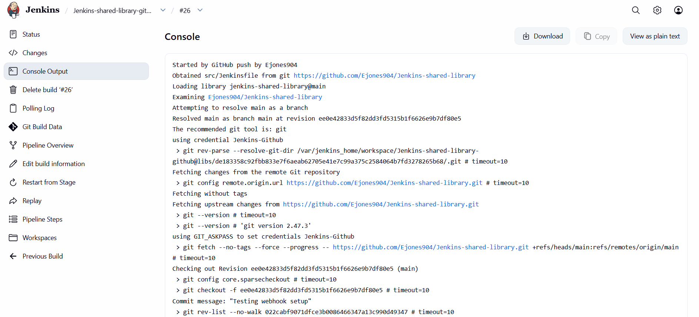
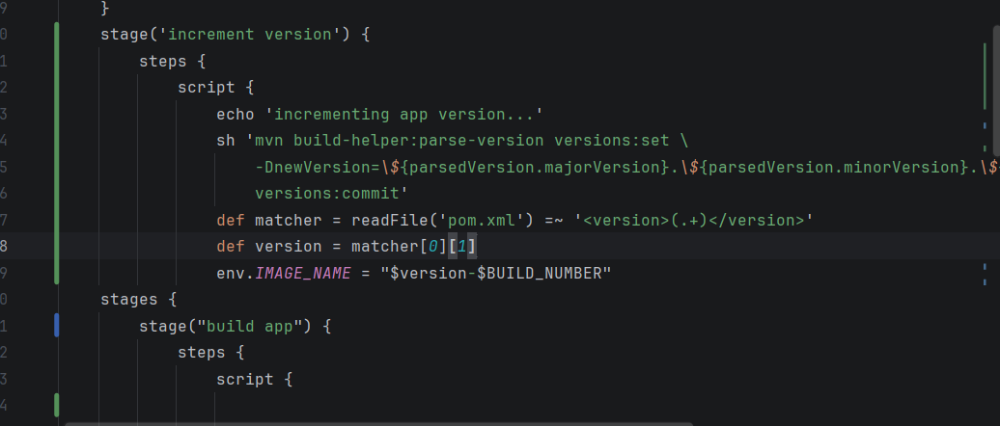
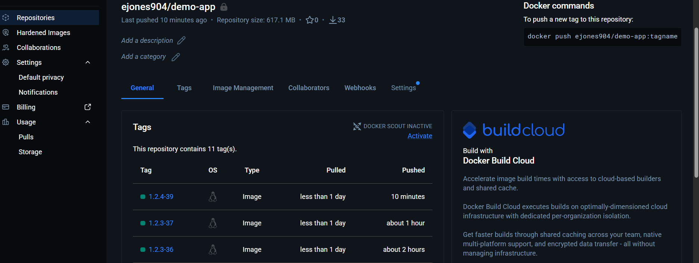
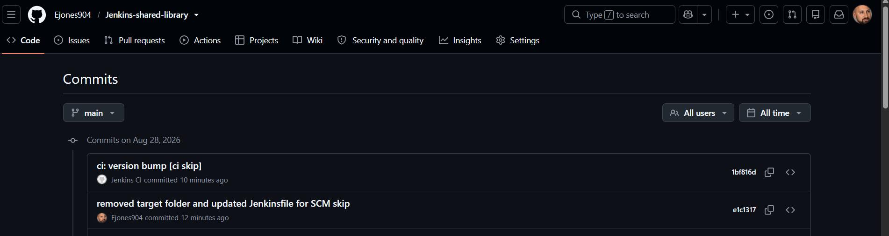
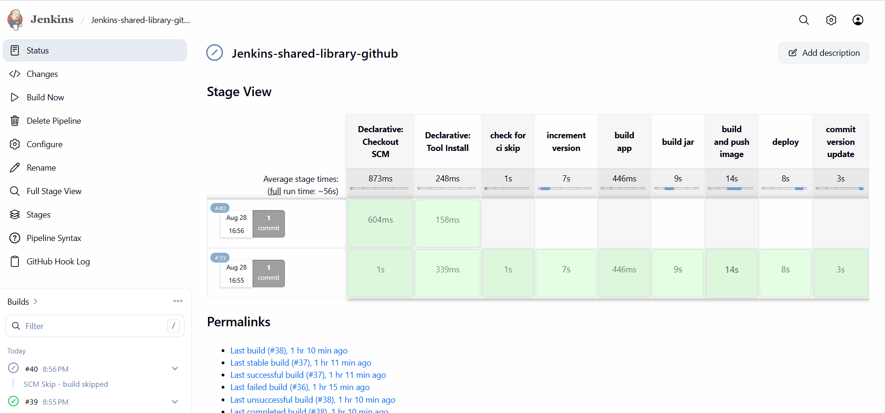

# Jenkins CI/CD Pipeline — Automated Builds, Versioning, and Container Delivery

## Project Overview

This project demonstrates the evolution of a Jenkins CI/CD workflow from a manually triggered build into an automated, event-driven software delivery pipeline.

The project progressed through several stages: building a Java application with Maven, creating reusable Jenkins Shared Library functions, containerizing and publishing the application with Docker, triggering builds automatically through GitHub webhooks, automatically incrementing application versions, creating traceable Docker image tags, and allowing Jenkins to persist version changes back to GitHub.

The final challenge was controlling the automation itself. Because Jenkins pushes the new version back to the same GitHub repository that triggers the pipeline, SCM Skip and `[ci skip]` were implemented to prevent recursive CI/CD executions.

---

## Business Context

The purpose of this project was to automate a common software delivery problem: moving a code change from source control to a versioned, deployable container with minimal manual intervention.

Without automation, teams may need to manually trigger builds, update application versions, create Docker tags, publish images, and keep source control synchronized with the version that was actually built. Those manual steps increase the risk of inconsistent releases, versioning mistakes, slower delivery, and poor traceability.

This pipeline creates a repeatable workflow where a developer can push code and Jenkins automatically builds, versions, containerizes, publishes, and records the resulting application version while using SCM Skip to prevent recursive builds.

---

## Technology Stack

| Technology             | Purpose                           |
| ---------------------- | --------------------------------- |
| Jenkins                | CI/CD orchestration               |
| Jenkins Shared Library | Reusable pipeline logic           |
| GitHub                 | Source control                    |
| GitHub Webhooks        | Automatic pipeline triggering     |
| Groovy                 | Pipeline and Shared Library logic |
| Maven 3.9              | Java build and version management |
| Java 17                | Application runtime               |
| Docker                 | Application containerization      |
| Docker Hub             | Container registry                |
| Jenkins Credentials    | Secure credential management      |
| Git                    | Source-control automation         |
| SCM Skip               | Recursive build prevention        |

---

## Final Architecture

```text id="5srmsu"
Developer
    │
    │ git push
    ▼
GitHub
    │
    │ Webhook
    ▼
Jenkins
    │
    ├── Check SCM Skip
    ├── Increment Maven Version
    ├── Build Java Application
    ├── Generate Dynamic Image Tag
    ├── Build Docker Image
    ├── Authenticate to Docker Hub
    ├── Push Docker Image
    └── Commit Updated pom.xml
             │
             │ git push
             ▼
           GitHub
             │
             │ Webhook
             ▼
           Jenkins
             │
             └── Detect [ci skip]
                         │
                         ▼
                    Pipeline Skipped
```

---

# Project Evolution

The project was intentionally built in stages:

```text id="xdnhpo"
Manual Jenkins Build
        ↓
Pipeline as Code
        ↓
Jenkins Shared Library
        ↓
Maven Build Automation
        ↓
Docker Build & Push
        ↓
GitHub Webhook
        ↓
Automatic Maven Versioning
        ↓
Dynamic Docker Image Tagging
        ↓
Automated Git Commit
        ↓
SCM Skip Loop Prevention
```

Each improvement removed another manual part of the delivery process while introducing new engineering considerations.

---

## 1. Reusable CI/CD with Jenkins Shared Libraries

The project initially used a Jenkins pipeline to build the Java application with Maven and create a Docker image.

As the pipeline grew, reusable build operations were moved into a Jenkins Shared Library.

The library is loaded with:

```groovy id="lyrtpd"
@Library('jenkins-shared-library') _
```

Reusable functions include:

```groovy id="hw00sz"
buildJar()
buildImage()
dockerLogin()
dockerPush()
```

The Shared Library separates reusable CI/CD operations from the Jenkinsfile and provides a structure that could be reused across additional pipelines.

The underlying Shared Library workflow was successfully validated with **Build #25**.


The resulting container image was also successfully published to Docker Hub.


---

## 2. Event-Driven Builds with GitHub Webhooks

The next manual step was starting Jenkins after a code change.

GitHub webhooks were introduced so that a Git push could automatically start the pipeline.

```text id="znnb53"
Developer
    ↓
git push
    ↓
GitHub
    ↓
Webhook
    ↓
Jenkins
    ↓
Pipeline
```

Jenkins was configured with:

```text id="oktt42"
GitHub hook trigger for GITScm polling
```

The GitHub webhook successfully established connectivity with Jenkins.



A real code change was then pushed to GitHub and Jenkins automatically started the pipeline without manually selecting **Build Now**.



At this point, the CI/CD workflow had become event-driven.

---

## 3. Automatic Maven Versioning

Application versioning was the next manual process to automate.

The Maven version increment was first tested locally before being added to Jenkins. This helped validate Maven independently before adding another layer to the pipeline.

A new Jenkins stage was then created:

```groovy id="3n1f94"
stage('increment version') {
    steps {
        script {
            echo 'incrementing app version...'

            sh '''
                mvn build-helper:parse-version versions:set \
                    -DnewVersion='${parsedVersion.majorVersion}.${parsedVersion.minorVersion}.${parsedVersion.nextIncrementalVersion}' \
                    versions:commit
            '''

            def matcher = readFile('pom.xml') =~ '<version>(.+)</version>'
            def version = matcher[0][1]

            env.IMAGE_NAME = "${version}-${BUILD_NUMBER}"

            echo "Image name: ${env.IMAGE_NAME}"
        }
    }
}
```

The pipeline now:

```text id="xwrdy9"
Reads Current Version
        ↓
Increments Patch Version
        ↓
Updates pom.xml
        ↓
Reads New Version
        ↓
Creates IMAGE_NAME
```



This removed the need to manually change the Maven application version for each pipeline execution.

---

## 4. Traceable Docker Image Versioning

The new Maven version is combined with the Jenkins build number:

```groovy id="m1v3yi"
env.IMAGE_NAME = "${version}-${BUILD_NUMBER}"
```

For example:

```text id="74ws90"
Application Version: 1.1.1
Jenkins Build:       32

Docker Image Tag:    1.1.1-32
```

The same value is used throughout the Shared Library:

```groovy id="z08xxj"
buildImage "ejones904/demo-app:${env.IMAGE_NAME}"

dockerLogin()

dockerPush "ejones904/demo-app:${env.IMAGE_NAME}"
```

This creates traceability between:

```text id="bf94qf"
Application Version
        +
Jenkins Build
        ↓
Docker Image
```

Instead of manually deciding which Docker tag should be used, the pipeline creates it consistently.



### Dynamic JAR Execution

Because Maven versioning also changes the generated JAR filename, the Dockerfile was changed from relying on a hardcoded application version to:

```dockerfile id="99q8z3"
CMD java -jar java-maven-app-*.jar
```

The Dockerfile can therefore execute the newly generated JAR without needing to be manually updated after every version change.

---

## 5. Persisting the Version Back to GitHub

Incrementing `pom.xml` only inside the Jenkins workspace was not enough.

Without persisting the change, Jenkins could contain one application version while GitHub still contained another.

Jenkins was therefore configured to commit the updated `pom.xml` back to the repository.

The automated commit uses:

```text id="6tq49x"
ci: version bump [ci skip]
```

with the Git identity:

```text id="6ep3ao"
Jenkins CI
```

GitHub authentication is handled using the Jenkins-managed:

```text id="46o1g8"
Jenkins-Github
```

credential rather than hardcoding a Personal Access Token into source code.

The resulting workflow became:

```text id="ld2ytq"
Increment Version
      ↓
Build Application
      ↓
Build & Push Image
      ↓
Commit pom.xml
      ↓
Push Version to GitHub
```



### Detached HEAD Troubleshooting

The first automated push attempted:

```bash id="lqzw4c"
git push origin main
```

and failed because the Jenkins SCM checkout did not have a normal local `main` branch.

The command was changed to:

```bash id="lfpwus"
git push origin HEAD:main
```

This allowed the commit currently checked out by Jenkins to be pushed directly to GitHub's `main` branch.

---

## 6. Preventing a Recursive CI/CD Loop

Allowing Jenkins to push to GitHub introduced a new problem.

GitHub was already configured to trigger Jenkins whenever a push occurred.

The workflow could therefore become:

```text id="7v0q2a"
Jenkins
   ↓
Version Commit
   ↓
GitHub
   ↓
Webhook
   ↓
Jenkins
   ↓
Another Version Commit
   ↓
GitHub
   ↓
Webhook
   ↓
...
```

Every component was working correctly, but together they created the possibility of an infinite automation loop.

The Jenkins SCM Skip plugin was implemented as a guardrail.

The first stage of the pipeline checks for:

```text id="khmfsk"
[ci skip]
```

using:

```groovy id="9a1r36"
stage('check for ci skip') {
    steps {
        scmSkip(
            skipPattern: '.*\\[ci skip\\].*',
            deleteBuild: false
        )
    }
}
```

Normal developer commits do not contain `[ci skip]`, so the pipeline executes normally.

Jenkins-generated version commits do contain it:

```text id="wixmqt"
ci: version bump [ci skip]
```

GitHub still sends the webhook, but Jenkins detects the marker and skips the rest of the pipeline.

```text id="ygazus"
Developer Commit
      ↓
No [ci skip]
      ↓
Full Pipeline

Jenkins Version Commit
      ↓
[ci skip]
      ↓
Pipeline Skipped
```

This prevents Jenkins from continuously incrementing and committing new versions.

---

## Final Validation — Builds #39 and #40

The completed workflow was validated with two consecutive Jenkins executions.

### Build #39

Build #39 executed the normal CI/CD workflow successfully:

```text id="40gkmg"
GitHub Push
    ↓
Jenkins
    ↓
Version Increment
    ↓
Maven Build
    ↓
Docker Build
    ↓
Docker Push
    ↓
Version Commit
    ↓
SUCCESS
```

Jenkins then pushed its automated version commit back to GitHub.

### Build #40

That push generated another GitHub webhook and started Build #40.

The commit contained:

```text id="pk3fqv"
[ci skip]
```

SCM Skip detected the marker and prevented the complete pipeline from executing.

```text id="az5b9v"
Build #39
Full Pipeline
    ↓
SUCCESS
    ↓
Version Commit
    ↓
GitHub Webhook
    ↓
Build #40
    ↓
SCM Skip
    ↓
Pipeline Skipped
```



This validated both the automated delivery workflow and the guardrail designed to control it.

---

## Security

Credentials are not hardcoded into the repository.

Jenkins Credentials are used for:

* Docker Hub authentication
* GitHub authentication

The GitHub Personal Access Token is stored in Jenkins and injected only when required.

Secrets such as PATs, Docker Hub credentials, Jenkins credential values, and authenticated Git remote URLs should never be committed to the repository or exposed in screenshots.

---

## Key Troubleshooting Lessons

This project required troubleshooting across Jenkins, Git, Maven, Docker, Groovy, Linux, and GitHub.

Some of the major issues included:

* Docker socket permissions.
* Shared Library configuration.
* Maven source structure.
* Docker image tagging.
* Maven/shell variable expansion.
* Jenkins detached HEAD behavior.
* Recursive webhook execution.

One of the biggest lessons was that **a new error can mean progress**.

As failures moved farther through the pipeline, they often demonstrated that the previous issue had been successfully resolved.

Detailed errors, root causes, and fixes are documented separately in:

```text id="2e33yg"
TROUBLESHOOTING-AND-LESSONS-LEARNED.md
```

---

## Skills Demonstrated

* Jenkins Declarative Pipelines
* Jenkins Shared Libraries
* Pipeline as Code
* GitHub Webhooks
* Event-driven CI/CD
* Maven build automation
* Automated application versioning
* Dynamic Docker image tagging
* Docker and Docker Hub
* Jenkins Credentials
* Automated Git commits and pushes
* Git detached HEAD troubleshooting
* SCM Skip
* CI recursion prevention
* Groovy and shell scripting
* Linux permissions
* Credential management
* Build traceability
* CI/CD troubleshooting

---

## What I Learned

I started this project focused on learning Jenkins.

As the project progressed, the questions changed:

```text id="e3pp1y"
How do I build the application?
        ↓
How do I reuse the build logic?
        ↓
Why am I manually triggering the pipeline?
        ↓
Why am I manually managing versions?
        ↓
How do I persist the new version?
        ↓
What happens when Jenkins triggers itself?
```

That progression helped me understand that CI/CD is bigger than the tool being used to implement it.

Jenkins coordinated the workflow, but solving the problems required understanding how Git, GitHub, webhooks, Maven, Docker, credentials, shell commands, and Jenkins interact.

The most valuable part of the project was not getting a green build.

It was understanding **why each stage exists, what problem it solves, and what can happen downstream when another part of the process is automated.**

---

## Final Result

The project evolved from a basic Jenkins build into an event-driven CI/CD workflow where a developer can initiate the process with:

```bash id="v25p5c"
git push
```

and automatically trigger:

```text id="0d0xsu"
GitHub Webhook
      ↓
Jenkins
      ↓
Version Increment
      ↓
Maven Build
      ↓
Dynamic Docker Tag
      ↓
Docker Build
      ↓
Docker Hub Push
      ↓
Git Version Commit
      ↓
GitHub Push
      ↓
SCM Skip Guardrail
```

The final implementation demonstrates a repeatable software delivery workflow with automated versioning, artifact traceability, secure credential handling, reusable pipeline logic, and protection against unintended recursive execution.

---

## Author

**Ethan Jones**

Cloud & DevOps Portfolio
GitHub: `Ejones904`


